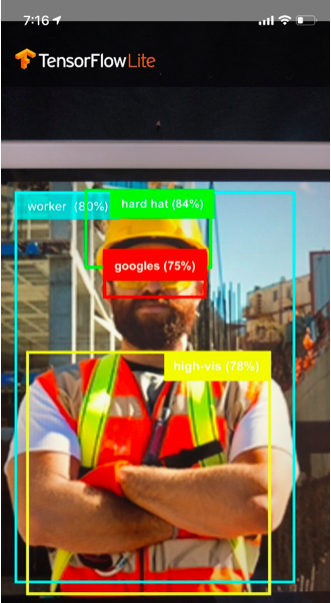

# Table of Contents

1.  [Project Report Status release dates](#org06b4680)
2.  [Proposal summary](#orgbf6d90a)
3.  [Development background](#org2c06021)
4.  [Expected outcomes](#orgb7b3ea4)
5.  [Project delivery](#org9e074f9)
    1.  [Duration:](#org11f7433)
6.  [Project team](#orgbd30eac)
7.  [Project milestones](#org3c94ef0)
8.  [Project status](#orgc7317bd)
    1.  [Issue tracker and code repository set-up](#org1d42662)
        1.  [Summary](#org6bb8543)
        2.  [Status at the issue of Report 01.](#org6b695c1)
    2.  [Data collection](#org4e8c1d4)
        1.  [Summary](#org30e0c89)
        2.  [Status at issue of Report 01](#org1263f99)
        3.  [Implications on project goal](#org277056b)
    3.  [Data labelling](#org8629c3c)
        1.  [Summary](#org032c7c1)
        2.  [Status at issue of Report 01](#org5c3f8e9)
    4.  [System architecture](#org2a47cf8)
        1.  [Summary](#org96ad755)
        2.  [Status at issue of Report 01](#org48c27bb)
    5.  [Network design](#org9b623a9)
        1.  [Summary](#org9508856)
        2.  [Status at issue of Report 01](#orgbc97ca0)
    6.  [Network training](#org9490b11)
        1.  [Summary](#org2be15c9)
        2.  [Status at issue of Report 01](#orgbed7377)
    7.  [Network evaluation](#org686405d)
        1.  [Summary](#orga5d043d)
        2.  [Status at issue of Report 01](#orge403fee)
    8.  [Application development](#orgf978e45)
        1.  [Summary](#orgabec843)
        2.  [Status at issue of Report 01](#orgeec811e)
    9.  [Application deployment](#org571f1b4)
        1.  [Summary](#org09b4831)
        2.  [Status at issue of Report 01](#org5a4f29f)
    10. [Scrum events and project management](#org0db1a18)
        1.  [Summary](#org1635bb6)
        2.  [Status at issue on Report 01](#org335aa6e)
    11. [Final comments](#org9ec75b5)
        1.  [Report 01](#org98b7ce9)
9.  [Attachments](#org2558314)

# Project Report Status release dates

<table border="2" cellspacing="0" cellpadding="6" rules="groups" frame="hsides">

<colgroup>
<col  class="org-left" />

<col  class="org-right" />

<col  class="org-left" />
</colgroup>
<thead>
<tr>
<th scope="col" class="org-left">Issue</th>
<th scope="col" class="org-right">Version</th>
<th scope="col" class="org-left">Date</th>
</tr>
</thead>

<tbody>
<tr>
<td class="org-left">Report 01</td>
<td class="org-right">1.00</td>
<td class="org-left">21/01/2021</td>
</tr>
</tbody>
</table>

# Proposal summary

In 2013, The New Zealand Government set a target to reduce work-related fatalities and serious injuries by at least 25% in seven years. 
Worksafe, the country's primary workplace health and safety (H&S) regulator, has used three work-related indicators to measure the progress over this period. 
The latest official data released by Stats NZ indicated that despite the initial decline two out of these three indicators have bounced back in the past few years (Figure 1 ), where the construction industry recorded the highest number of incidents related to indicator 2 and the second highest in indicator 3.  

")

A review of the current safety management conducts in the construction industry shows them taking stock in individual reporting and filing colossal paperwork.
It makes their output prone to human errors originated either from mistakes or from slips and lapses of memory.
These issues together with the potential physical loss of information present a serious flaw in the system.
Simultaneously, companies are forced to bid with the lowest profit margins to survive in their high competitive environment. 
Therefore, it is a high priority for every construction company to take up an H&S compliance management solution that could balance costs, risks and governance.
This proposal aims to complete one step towards sustaining a system that combines the power of machine learning and image processing to \`\`smartify'' the risk identification and reporting at the construction sites. Image processing enables the analysis of the safety compliance based on images from the job site.
Machine learning applies artificial intelligence (AI) to automate learning and to improve from experience without being explicitly programmed.
The proposed system provides an accessible and inexpensive solutions operable from the ordinary devices such as the mobile phones with a minimum no training period.

# Development background

This research presents a novel idea in the field of construction H&S that was initiated by two early-carrier researchers of the Built Environment Engineering department at AUT. It was elaborated further by taking to an external industrial project manager.
The team completed an initial feasibility assessment by testing the capability of the combination of Image processing and machine learning in a particular case (Figure 2).
Next, the idea was presented to BRANZ, a major player of research, testing, and consulting in the New Zealand building industry at two steps.
In the first step, a senior scientist of the company investigated the idea, who brought it to the attention of their investment manager.
The second step involved rationalising the definition of a research project based on the proposed idea for the funders. As a result, the team was encouraged to apply for an out of cycle funding subject to providing a proof of concept in the industrial context.
Accordingly, a senior scholar in the computer science department at AUT was invited and joined in mid-2019.
Since then, the team has worked on presenting the idea to the potential stakeholders form the industry. 

# Expected outcomes

  This study researches into a niche area, leading to contextual benchmarks for smartification of the compliance management in the construction sector.
It can provide useful pointers and information with a contextual transferability of results to the peer domains.

# Project delivery

-   Febrary 15th, 2021

-   Schedule of the project delivery: The project period is December 1st, 2020 to February 15th, 2021
-   Estimated total number of hours for delivery of the project 250 hours.

## Duration:

-   Weeks: 11

# Project team

1.  Dr. Mani Poshdar (mani.poshdar@aut.ac.nz) - *Principal Investigator*
2.  Dr. Ricardo Antunes (ricardo.antunes@aut.ac.nz) - *Project Manager*
3.  Dr. Mohammad Norouzifard (mohammad.norouzifard@aut.ac.nz) - *Developer*

# Project milestones

<table border="2" cellspacing="0" cellpadding="6" rules="groups" frame="hsides">

<colgroup>
<col  class="org-left" />

<col  class="org-left" />

<col  class="org-left" />

<col  class="org-left" />
</colgroup>
<thead>
<tr>
<th scope="col" class="org-left">Milestone</th>
<th scope="col" class="org-left">Planned date</th>
<th scope="col" class="org-left">Status</th>
<th scope="col" class="org-left">Actual date</th>
</tr>
</thead>

<tbody>
<tr>
<td class="org-left">Project kick-off</td>
<td class="org-left">December 1st, 2020</td>
<td class="org-left">Done</td>
<td class="org-left">January 11th, 2021</td>
</tr>

<tr>
<td class="org-left">Status Report 01</td>
<td class="org-left">Thursday 21st, 2021</td>
<td class="org-left">Done</td>
<td class="org-left">Thursday 21st, 2021</td>
</tr>

<tr>
<td class="org-left">Project delivery</td>
<td class="org-left">February 15th, 2021</td>
<td class="org-left">&#xa0;</td>
<td class="org-left">&#xa0;</td>
</tr>
</tbody>
</table>

# Project status

The current status of project is shown in the table bellow.

<table border="2" cellspacing="0" cellpadding="6" rules="groups" frame="hsides">

<colgroup>
<col  class="org-left" />

<col  class="org-right" />

<col  class="org-right" />

<col  class="org-right" />

<col  class="org-left" />

<col  class="org-left" />
</colgroup>
<thead>
<tr>
<th scope="col" class="org-left">Description</th>
<th scope="col" class="org-right">Assigned to</th>
<th scope="col" class="org-right">Planned Effort (h)</th>
<th scope="col" class="org-right">Actual Effort (h)</th>
<th scope="col" class="org-left">Status</th>
<th scope="col" class="org-left">Overall</th>
</tr>
</thead>

<tbody>
<tr>
<td class="org-left">Issue tracker / repository</td>
<td class="org-right">3</td>
<td class="org-right">0</td>
<td class="org-right">0</td>
<td class="org-left">Not started</td>
<td class="org-left">Delayed</td>
</tr>

<tr>
<td class="org-left">Data collection</td>
<td class="org-right">3</td>
<td class="org-right">30</td>
<td class="org-right">0</td>
<td class="org-left">Not started</td>
<td class="org-left">Delayed</td>
</tr>

<tr>
<td class="org-left">Data labelling</td>
<td class="org-right">3</td>
<td class="org-right">50</td>
<td class="org-right">0</td>
<td class="org-left">Not started</td>
<td class="org-left">Delayed</td>
</tr>

<tr>
<td class="org-left">System architecture</td>
<td class="org-right">3</td>
<td class="org-right">10</td>
<td class="org-right">0</td>
<td class="org-left">Not started</td>
<td class="org-left">Delayed</td>
</tr>

<tr>
<td class="org-left">Network design</td>
<td class="org-right">3</td>
<td class="org-right">10</td>
<td class="org-right">0</td>
<td class="org-left">Not started</td>
<td class="org-left">Delayed</td>
</tr>

<tr>
<td class="org-left">Network training</td>
<td class="org-right">3</td>
<td class="org-right">50</td>
<td class="org-right">0</td>
<td class="org-left">Not started</td>
<td class="org-left">&#xa0;</td>
</tr>

<tr>
<td class="org-left">Network evaluation</td>
<td class="org-right">3</td>
<td class="org-right">20</td>
<td class="org-right">0</td>
<td class="org-left">Not started</td>
<td class="org-left">&#xa0;</td>
</tr>

<tr>
<td class="org-left">Network testing</td>
<td class="org-right">1,2,3</td>
<td class="org-right">15</td>
<td class="org-right">0</td>
<td class="org-left">Not started</td>
<td class="org-left">&#xa0;</td>
</tr>

<tr>
<td class="org-left">Application development</td>
<td class="org-right">2</td>
<td class="org-right">0</td>
<td class="org-right">0</td>
<td class="org-left">Not started</td>
<td class="org-left">&#xa0;</td>
</tr>

<tr>
<td class="org-left">Application deployment</td>
<td class="org-right">2</td>
<td class="org-right">0</td>
<td class="org-right">0</td>
<td class="org-left">Not started</td>
<td class="org-left">&#xa0;</td>
</tr>

<tr>
<td class="org-left">Scrum events</td>
<td class="org-right">1</td>
<td class="org-right">0</td>
<td class="org-right">0</td>
<td class="org-left">On going</td>
<td class="org-left">&#xa0;</td>
</tr>
</tbody>

<tbody>
<tr>
<td class="org-left">Total</td>
<td class="org-right">32</td>
<td class="org-right">185</td>
<td class="org-right">0</td>
<td class="org-left">Delayed</td>
<td class="org-left">Delayed</td>
</tr>
</tbody>
</table>

## Issue tracker and code repository set-up

### Summary

An issue tracking system is a computer software package that manages and maintains lists of issues.
Issue tracking systems are generally used in collaborative settings—especially in large or distributed collaborations—but can also be employed by individuals as part of a time management or personal productivity regime.

-   Github (<http://www.github.com>) is the intended repository for the project.

### Status at the issue of Report 01.

-   The issue tracking system and code repository has not been set by the responsible.

## Data collection

### Summary

Data is either images or videos where the equipment is show.
The amount, quality and variaty of the data collected impacts had a direct impact on the system accuracy. 

### Status at issue of Report 01

The data collection has been restricted to data collecte due to project inactivity and approaching that project delivery date.
The data will now be artificially generated using one webcam, one hard-hat and 1 hight-vizibilty jacket/vest provided by Dr. Roohollah Kalatehjari on 20/01/2021.
The recording area in use is WZ level 1.
The approximate installation height of the camera will be 2.20m. 
The recording are will help the developer to prepare the required footages for the training phase.

The *project manager* collected 4 videos containing footage of contruction sites, uploaded and shared (<https://www.dropbox.com/sh/d3uqcid7xkq8yog/AABPCOxROcyahOiHVtWs6YLNa?dl=0>) with *developer*.

1.  Resources

    The following resources were provided to the devoper on 20 Jan 2021:
    
    <table border="2" cellspacing="0" cellpadding="6" rules="groups" frame="hsides">
    
    
    <colgroup>
    <col  class="org-right" />
    
    <col  class="org-left" />
    </colgroup>
    <thead>
    <tr>
    <th scope="col" class="org-right">Quantitity</th>
    <th scope="col" class="org-left">Resource</th>
    </tr>
    </thead>
    
    <tbody>
    <tr>
    <td class="org-right">1</td>
    <td class="org-left">webcam</td>
    </tr>
    
    
    <tr>
    <td class="org-right">1</td>
    <td class="org-left">hard hat</td>
    </tr>
    
    
    <tr>
    <td class="org-right">1</td>
    <td class="org-left">high-visibility jacket (hi-viz)</td>
    </tr>
    </tbody>
    </table>

### Implications on project goal

The final goal is to provide a prototype that detects if people are using hard-hat and high-visibility jackets/vests at any of the entries of the laboratory area of WZ building.
The accuracy of the system is expected to be inefficient on a construction scenario because of the lack Of approppriate data.

## Data labelling

### Summary

The equipment when present on the data has to be labelled.
That means either draw a polygon around each equipment of interest on each image or frame (in the case of video) of the data collection.

### Status at issue of Report 01

-   This event has not starded yet.

## System architecture

### Summary

The system architecture is the conceptual model that defines the structure, behavior, and more views of a system.
An architecture description is a formal description and representation of a system, organized in a way that supports reasoning about the structures and behaviors of the system.
The system architeture depends of the final form of deployment, source format, source resolution, scaliability, among other factors.

### Status at issue of Report 01

-   This event has not starded yet.

## Network design

### Summary

The system may contain several networks depending of the funcionalities and system architeture.

### Status at issue of Report 01

-   This event has not starded yet.

## Network training

### Summary

Different networks require training methods and efforts.
Training requires preparation and sortout data and prototyping.

### Status at issue of Report 01

-   This event has not starded yet.

## Network evaluation

### Summary

Every network should perform with sufficient accuracy.

### Status at issue of Report 01

-   This event has not starded yet.

## Application development

### Summary

Once trained, the network should be wrapped by an application.
That enables the end-user to utilize the system without further requirement other than those instructions presented on the screen.

### Status at issue of Report 01

-   This event has not starded yet.

## Application deployment

### Summary

The application deployment involves make the application availabe in a suitable host.
For instance, the application run stand alone on a desktop computer or online as a website or as and mobile phone application.

### Status at issue of Report 01

-   This event has not starded yet.

## Scrum events and project management

### Summary

-   Scrum is an agile framework for developing, delivering, and sustaining complex products, with an initial emphasis on software development

It is designed for teams of ten or fewer members, who break their work into goals that can be completed within timeboxed iterations, called sprints, no longer than one month and most commonly two weeks.
At the end of the sprint, the team holds sprint review, to demonstrate the work done, and sprint retrospective to continuously improve.

### Status at issue on Report 01

-   Kick off meeting (11/01/20201 17:00):
    -   Participants: all project team.
    -   The *principal investigator*
        -   explained how the project goal and structured, roles, hours and rate (NZD/hour) as per the AUT summer research proposal;
        -   discussed the project goal.
        -   informed about the progress report and its deadline, i.e., 'Project Status Report 01', with deadline on 21/01/2021.
    -   The *project manager*
        -   explained the prototype for the project realized on 2018.
        -   requested the *developer* to submit the following information to feature on 'Project Status Report 01':
            -   System architeture and framework;
            -   Network design (or existent network)
    -   The *developer*;
        -   discussed a similar appliacion featured on AWS
        -   denied to developed the application and its deployment (front-end).
            -   The *project manager* assumed the application development and deployment.
        -   requested the data
            -   The *project manager* clarified that data collection is due to the *developer* and also what kind of data the project aims to use.
            -   The *project manager* collected video footage. Vide Data collection section.
        -   requested access to GPU or on cloud processing
            -   The *project manager* emailed the google gcloud trial that can be used for the project.
-   Other
    -   Contacts were shared,
    
    -   The *developer* was added to the existent #summer-research Slack channel.

## Final comments

### Report 01

The project has shown no progress.
That is troublesome because the raw protype delevoped with mobile application has been completed in 15 days.
The scope has been reduced and simplified to use restricted data.
Thus, the project application in construction, as intended, might compromised.
And despite the scope reduction and project simplification regarding dala collection the *developer* has not report work advancement.

# Attachments

`This document has no attacthmens`

&#x2014; End of document &#x2014;

